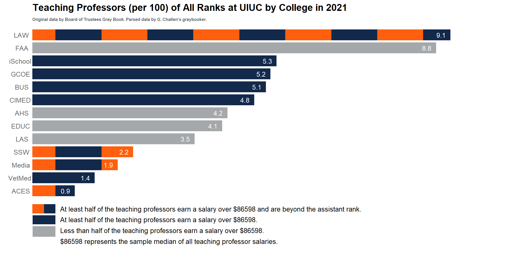

# Submission for 2024 Big Ten Academic Alliance (BTAA) Data Viz Championship
## btaa2024-data-viz-championship

The code and data visualizations in this repo are created for the 2024 Big Ten Academic Alliance (BTAA) Data Viz Championship [https://btaa.org/research/love-data-week/compete](https://btaa.org/research/love-data-week/compete). This event is a part of International Love Data Week [https://www.icpsr.umich.edu/web/about/cms/3799](https://www.icpsr.umich.edu/web/about/cms/3799).

The data viz is not an existing data viz created by the University of Illinois. The reproducible R code and data viz are created by me, Chris Kinson, PhD [https://chriskinson.com/](https://chriskinson.com/). The original data is provided by the Board of Trustees Gray Book [https://www.bot.uillinois.edu/resources/gray_book](https://www.bot.uillinois.edu/resources/gray_book). The parsed data is provided by G. Challen's graybooker [https://github.com/gchallen/graybooker](https://github.com/gchallen/graybooker). I did receive helpful feedback from D. Dalpiaz [https://daviddalpiaz.org/](https://daviddalpiaz.org/) and I tend to follow design ideas from C. Knaflic's Storytelling with Data [https://www.storytellingwithdata.com/](https://www.storytellingwithdata.com/). Eventually, an interactive Shiny web application will be created such that users can explore the data for various colleges, departments, and time periods.

